# uDeckLaunch

<p align="center">
  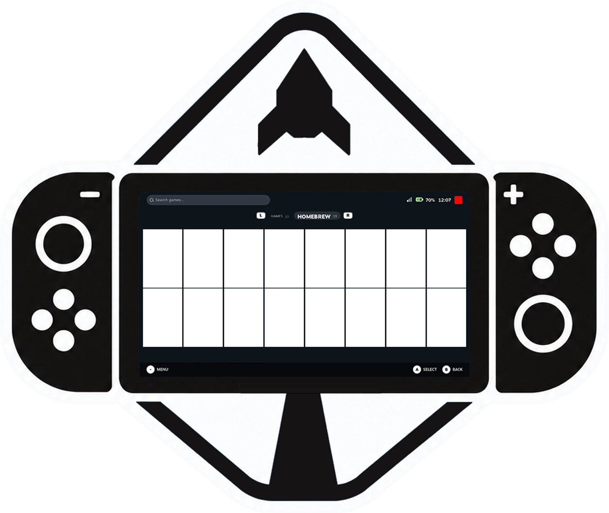
</p>

<p align="center">
  A Steam Deck–style HOME menu for Nintendo Switch.<br/>
  Built on <a href="https://github.com/XorTroll/uLaunch">uLaunch</a> by <a href="https://github.com/XorTroll">XorTroll</a>.
</p>

Not affiliated with Valve or Nintendo.

---

## Screenshots

<p align="center">
  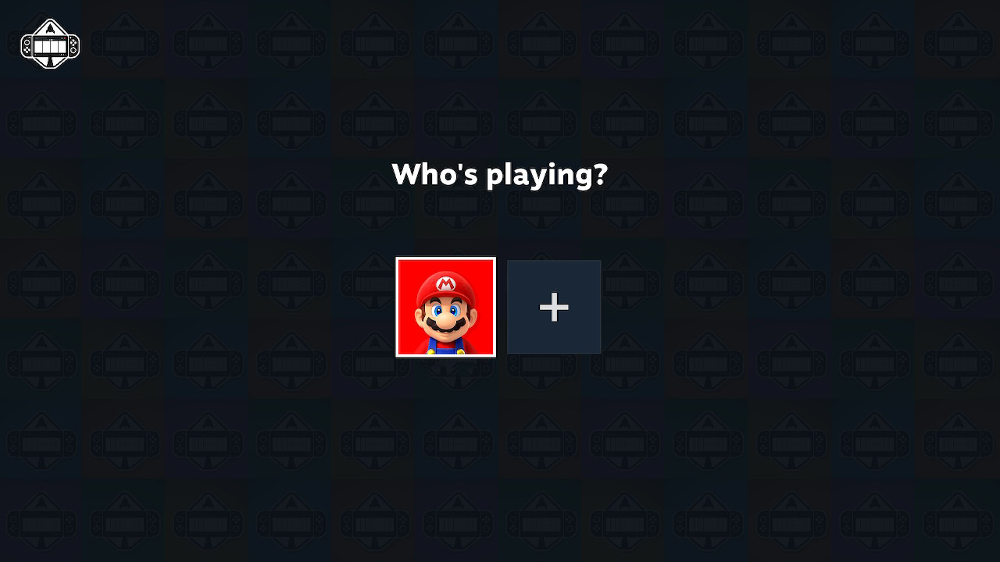
  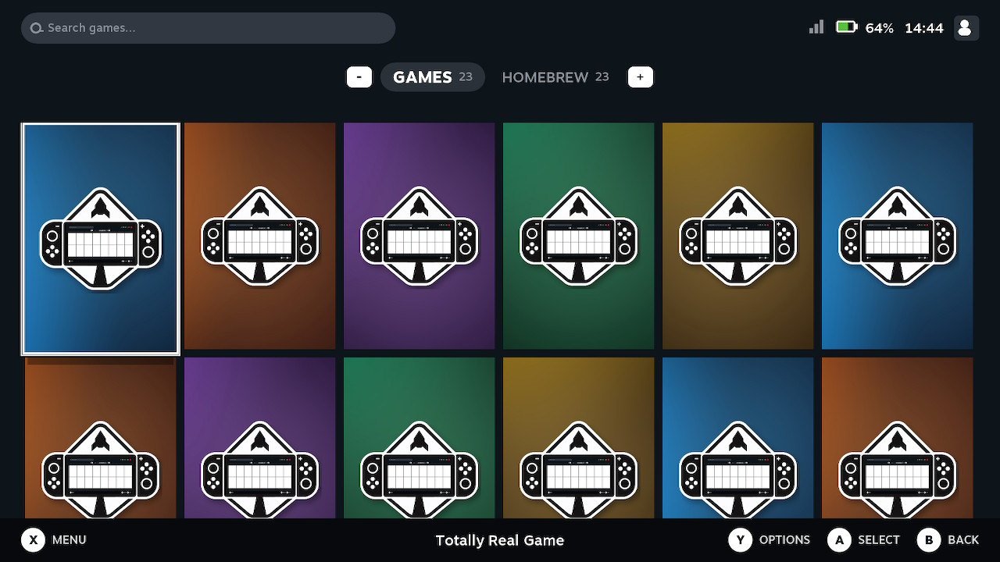
</p>
<p align="center">
  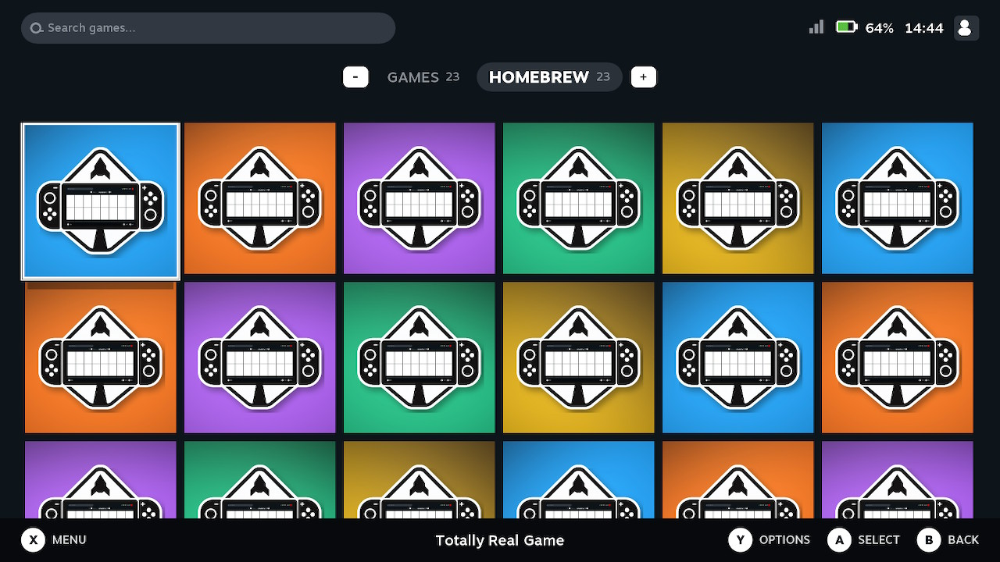
  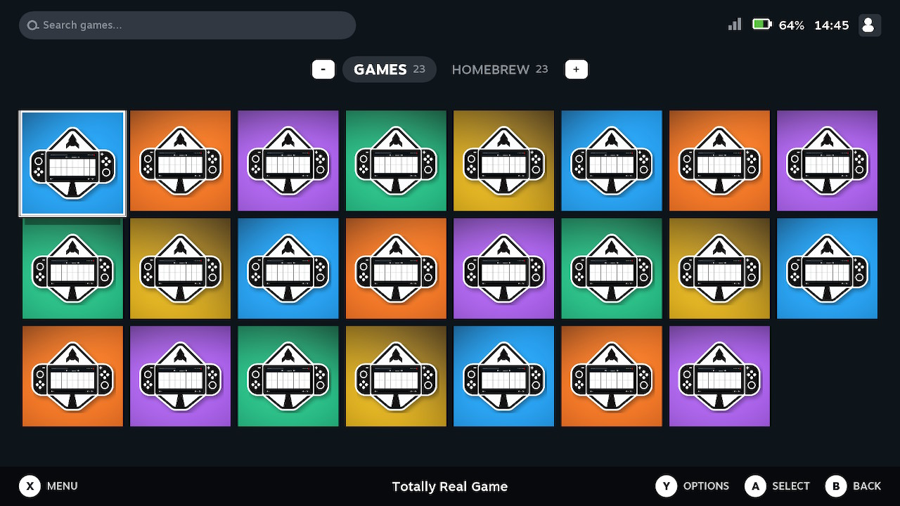
</p>
<p align="center">
  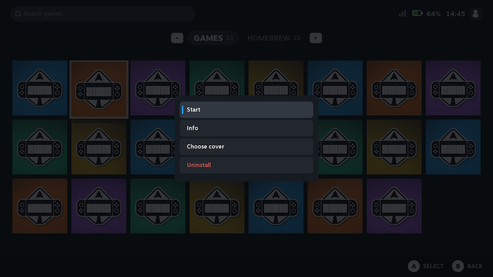
</p>

The library shots above use **Screenshot covers** so no real titles are shown.

---

## What it is

uDeckLaunch replaces the HOME you see after Atmosphère boot. Games and homebrew live on one grid, with a Deck-style layout instead of stock uLaunch’s 3DS-style menu.

The HOME process, launch path, takeover, uLoader, and SMI still come from uLaunch. This project is a new **uMenu** on top of that.

| Piece | Role |
| --- | --- |
| **uSystem** | Real HOME process (`0100000000001000`). Always running. |
| **uMenu** | The Deck UI. Talks to uSystem over SMI. |
| **uLoader** | Loads `.nro` files as an application or as an applet. |

---

## Features

- **Games** and **Homebrew** tabs, with counts ready before you switch
- **A** launches the focused title
- Homebrew as a full application (full RAM) through uLaunch takeover. Falls back to applet mode if that fails
- Search, Album, Sleep, Reboot, Power Off
- Library layout: square or cover tiles, size, sort, stick, row wrapping
- Covers from **uDeck** or **SteamGridDB**
- Per-title cover picker
- Sounds for navigation, launch, and startup
- UI language follows the Switch language, and can be changed in settings (English, Deutsch, Español, Français, Italiano, Português (BR), 한국어)
- **Screenshot covers**: swap every cover for generated uDeckLaunch art and show every title as *Totally Real Game*

---

## Settings

All of this is in uDeckLaunch itself. There is no separate theme picker.

<p align="center">
  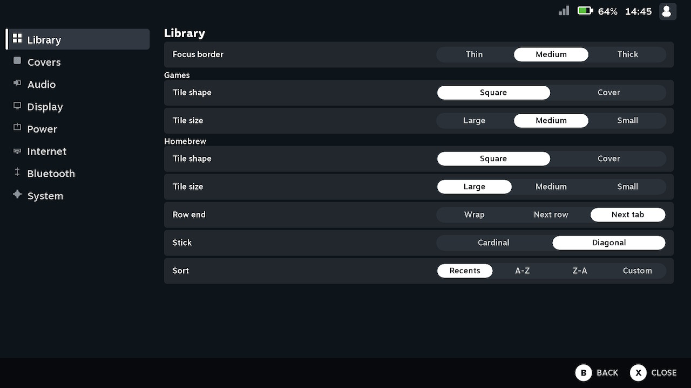
  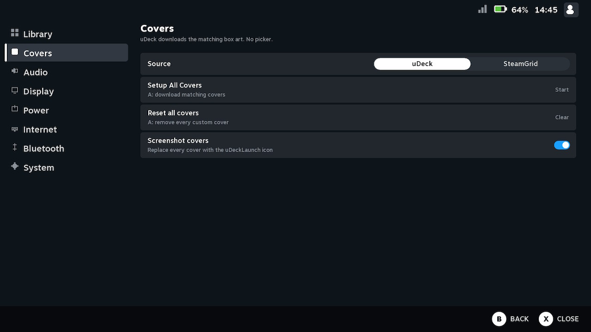
</p>
<p align="center">
  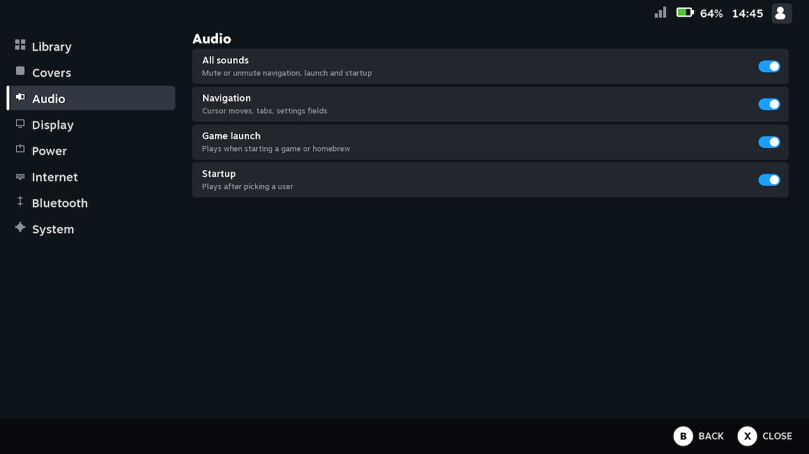
  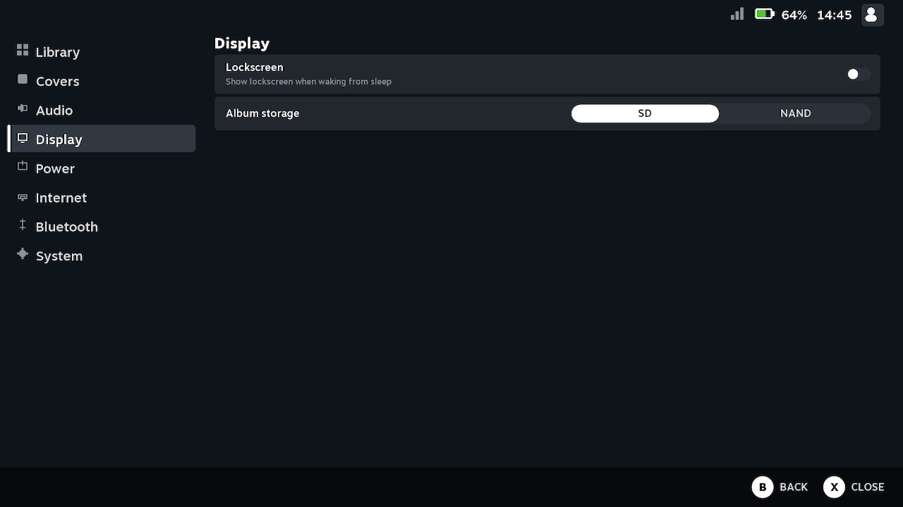
</p>
<p align="center">
  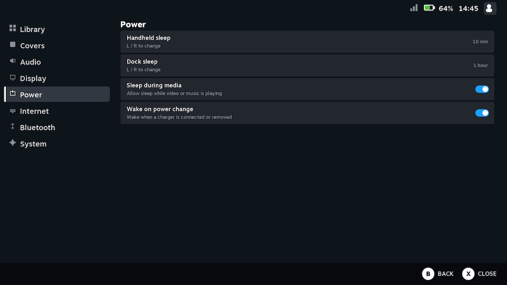
  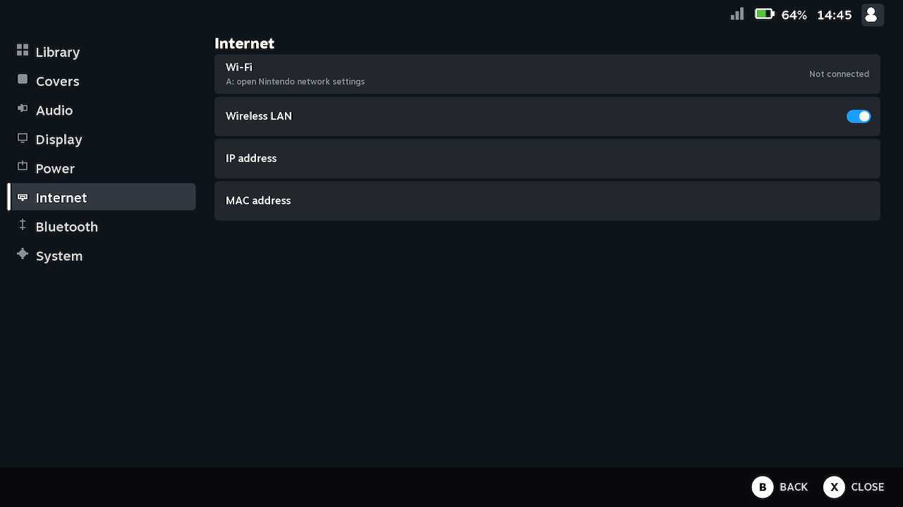
</p>
<p align="center">
  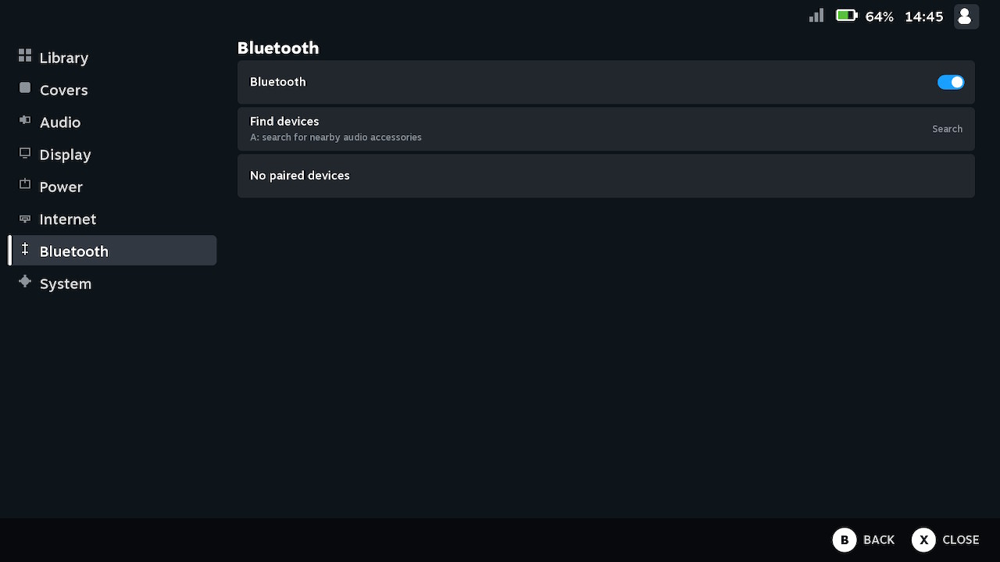
  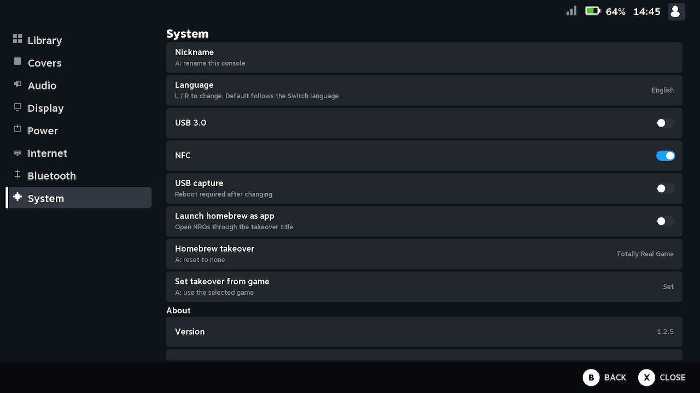
</p>

| Page | What it covers |
| --- | --- |
| **Library** | Focus border, tile shape/size for games and homebrew, row end, stick, sort |
| **Covers** | uDeck vs SteamGrid, download all, reset, screenshot covers |
| **Audio** | Master, navigation, launch, startup |
| **Display** | Lockscreen, album storage |
| **Power** | Handheld / dock sleep, media sleep, wake on charger |
| **Internet** | Wi-Fi, wireless LAN, IP, MAC |
| **Bluetooth** | Toggle, find devices |
| **System** | Nickname, language, USB 3.0, NFC, capture, homebrew-as-app, takeover |

---

## Install

Needs [Atmosphère](https://github.com/Atmosphere-NX/Atmosphere). Built against AMS 1.11.x / uLaunch 1.2.5.

1. Build the installer:

```bash
export DEVKITPRO=/opt/devkitpro
cd uDeckLaunch
make installer
```

2. Copy one file to the SD card:

```
switch/uDeckLaunch/uDeckLaunch.nro
```

3. Boot Atmosphère, open **hbmenu** (R + game, or R + Album), run **uDeckLaunch**.

On first run it unpacks to the SD card, activates the HOME overlay, and reboots. After that, uDeckLaunch HOME loads on its own.

A GitHub Actions build also produces `SdOut.zip` if you do not want to compile locally.

To disable without uninstalling: run the same NRO from hbmenu and turn activation off.

---

## Uninstall

- **Disable only:** run `switch/uDeckLaunch/uDeckLaunch.nro` from hbmenu and deactivate.
- **Restore official HOME:** delete `atmosphere/contents/0100000000001000/exefs.nsp` and reboot.
- **Full wipe:** also remove `sdmc:/ulaunch` and `switch/uDeckLaunch/`.

---

## Homebrew: application vs applet

**Application (takeover)** is the default. A real game title ID hosts the `.nro` so it gets full RAM and can sit in the background with HOME.

**Applet** is the small Album-sized mode. Fine for tiny tools, tight for Sphaira, DBI, and emulators.

You need at least one installed game for takeover. If none is set yet, the first installed game is used.

---

## Build

devkitPro, devkitA64, libnx, and Switch SDL2 packages:

`switch-sdl2 switch-freetype switch-glad switch-libdrm_nouveau switch-sdl2_gfx switch-sdl2_image switch-sdl2_ttf switch-sdl2_mixer`

```bash
export DEVKITPRO=/opt/devkitpro
git clone --recurse-submodules <this-repo> uDeckLaunch
cd uDeckLaunch
make umenu
```

`make umenu` writes `SdOut/ulaunch/bin/uMenu/`.

`make installer` also builds the hbmenu NRO.

`make` / `make usystem` / `make uloader` still exist from upstream if you need to rebuild the HOME backend.

---

## License and credits

GPL-2.0, same as uLaunch. See [LICENSE](LICENSE).

**This would not exist without [uLaunch](https://github.com/XorTroll/uLaunch).** uSystem, uLoader, SMI, ECS, takeover, and the startup / lockscreen path are [XorTroll](https://github.com/XorTroll)’s work. Please star and support that project.

Also: SciresM (Atmosphere-libs), Switchbrew (libnx, nx-hbloader), C4Phoenix (original uLaunch logo).
